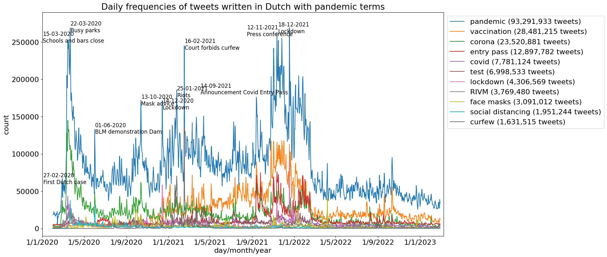

# PuReGoMe

[PuReGoMe](https://research-software.nl/projects/4728) is a research project of [Utrecht University](https://www.uu.nl/en/research/intelligent-software-systems/intelligent-systems) and the [Netherlands eScience Center](https://www.esciencecenter.nl/). We analyze Dutch social media messages to assess the opinion of the public towards the COVID-19 pandemic mesasures taken by the Dutch government.

## Data

PuReGome uses three data sources for social media analysis. Our main data source are Dutch tweets from [Twitter](https://twitter.com/). We use Dutch posts from [Reddit](https://www.reddit.com/) and comments from [Nu.nl](https://www.nu.nl) as sources of verfication of the results obtained by the tweet analysis.

After a month has ended, the data from the month are collected. Here are the steps taken for each data source:

### Twitter

1. the tweets are taken from the crawler of [twiqs.nl](http://twiqs.nl). They are stored in json format in hourly files. (this data set is not publically available)
2. the tweets are extracted from the json files and and stored in csv files (six columns: id\_str, in\_reply\_to\_status\_id\_str, user, verified, text, location). The conversion is performed by the script [query-text.py](https://github.com/puregome/queries/blob/master/query-text.py)
3. duplicate tweets are removed from from the csv files produced in step 2 by the script [text-unique.py](https://github.com/puregome/scripts/blob/master/text-unique.py)

(it would be useful to combine steps 2 and 3 in the future)

### Reddit

1. In a new month directory, run the script [get\_subreddit\_ids.py](https://github.com/puregome/scripts/blob/master/get_subreddit_py) to automatically retrieve the subreddits of the Dutch corona reddits
2. Manually expand the list of ids of the subreddit [Megathread Coronavirus COVID-19 in Nederland](https://www.reddit.com/r/thenetherlands/search?q=Megathread+Coronavirus+COVID-19+in+Nederland&restrict_sr=on&sort=new&t=all)
3. Run the script [coronamessagesnl.py](https://github.com/puregome/scripts/blob/master/coronamessagesnl.py) on the files `submissions_ids_*` to automatically retrieve the posts in the found subreddits
4. Run the notebook [reddit.ipynb](reddit.ipynb) to get all the posts from the monthly `downloads` directory and store them in the directory `text`

### Nu.nl

1. Run code blocks 1, 3 and 4 of the notebook [selenium-test.ipynb](selenium-test.ipynb), after updating the name of the file in URLFILE in code block 4
2. Restart the notebook and run code blocks 1 and 6, after updating the name of the file in URLFILE in code block 6 to the same value as under code block 4, and changing the name of the new downloads directory. This takes many hours to complete
3. The notebook can be copied and several copies can be run in parallel
4. When the notebooks have finished: delete all files of sizes 1 and 3 in this month's directory and rerun the notebooks
5. Repeat step 4 until no articles with comments are found
6. go to (cd) the directory data/nunl
7. run the script [../../scripts/combineNunlComments.sh](https://github.com/puregome/scripts/blob/master/combineNunlComments.sh) to update the files in the main directory `downloads`
8. run the notebook [nunl-convert-data.ipynb](nunl-convert-data.ipynb) to regenerate the data files in the directory `text`
9. for fetching the article texts: run code blocks 1 and 2 of the notebook [selenium-test.ipynb](selenium-test.ipynb), after updating the variables `URLFILE` and `OUTFILEMETADONELIST`

## Analysis

PuReGome performs analysis on three different levels: by counting messages, by determining their polarity (sentiment) and by determining their stance with respect to anti-pandemic government measures.

### Frequency analysis

Frequency analysis of tweets is performed in the notebook [tweet-counts.ipynb](tweet-counts.ipynb). The notebook definies seven pandemic queries: corona, covid, RIVM, face masks, lockdown, social distancing and topic, where topic is a combination of terms relevant in the first months of the pandemic. The notebook produces a graph with the absolute daily frequencies of the tweets matching each of these pandemic queries:

Frequency analysis of the Nu.nl and Reddit data is included in the respective data generation notebooks [nunl-convert-data.ipynb](nunl-convert-data.ipynb) and [reddit.ipynb](reddit.ipynb)

### Polarity analysis

Polarity analysis is the same as sentiment analysis. This analysis is performed by the notebook [sentiment-pattern.ipynb](sentiment-pattern.ipynb) which uses the Python package [https://github.com/clips/pattern](Pattern) for sentiment analysis of Dutch text (De Smedt &amp; Daelemans, 2011). The notebook requires two types of input files: the csv files in the text directories of each of the data sources and sentiment score files which should be generated from these csv files wth the script [../../scripts/sentiment-pattern-text.py](https://github.com/puregome/scripts/blob/master/sentiment-pattern-text.py) The polarity analysis of the different topics takes a lot of time and can be run in parallel. It produces time series graphs for all tweets, all pandemic tweets and several individual pandemic topics.

### Stance analysis

Stance analysis is performed by the notebook [fasttext.ipynb](fasttext.ipynb). The analysis is performed by a model trained by [https://github.com/facebookresearch/fastText](fastText) in manually labeled tweets. The notebook contains a section for searching for the best parameters of fastText using grid search but when the training data is unchanged this section can be skipped. The notebook has two main modes related to topics: analysis related to the social distancing policy and analysis related to the former i(April 2020) facemask policy. These are currently the only two topics for which we have manually labeled training data. The graphs combine analysis for all three data sources used in the project: Twitter, Nu.nl and Reddit.

## Publications, talks and media coverage

Shihan Wang, Marijn Schraagen, Erik Tjong Kim Sang and Mehdi Dastani, [**Public Sentiment on Governmental COVID-19 Measures in Dutch Social Media**](https://openreview.net/forum?id=37zyB5yuPXi). In: Workshop on NLP for COVID-19 (Part 2) at EMNLP 2020
(NLP-COVID19-EMNLP), 20 November 2020.

Shihan Wang, Marijn Schraagen, Erik Tjong Kim Sang and Mehdi Dastani, [**Dutch General Public Reaction on Governmental COVID-19 Measures and Announcements in Twitter Data**](https://arxiv.org/abs/2006.07283). Preprint report on arXiv.org, 29 September 2020.

Erik Tjong Kim Sang [**PuReGoMe: Dutch Public Reaction on Governmental COVID-19 Measures and Announcements**](https://ifarm.nl/erikt/talks/20200626-escience.pdf). Lunch talk, Netherlands eScience Center, Amsterdam, The Netherlands, 26 June 2020.

Shihan Wang, **Public Sentiment during COVID-19 -Data Mining on Twitter data**. Talk at the [CLARIN Café](https://www.clarin.eu/content/clarin-cafe), Utrecht, The Netherlands, 27 May 2020.

Redactie Emerce, [**Onderzoekers leiden publieke opinie coronamaatregelen af uit social media-data**](https://www.emerce.nl/nieuws/onderzoekers-leiden-publieke-opinie-coronamaatregelen-af-uit-social-mediadata). Emerce, 12 May 2020 (in Dutch).

Nienke Vergunst, [**Researchers use social media data to analyse public sentiment about Coronavirus measures**](https://www.uu.nl/en/news/researchers-use-social-media-data-to-analyse-public-sentiment-about-coronavirus-measures). University of Utrecht news message, 11 May 2020.

